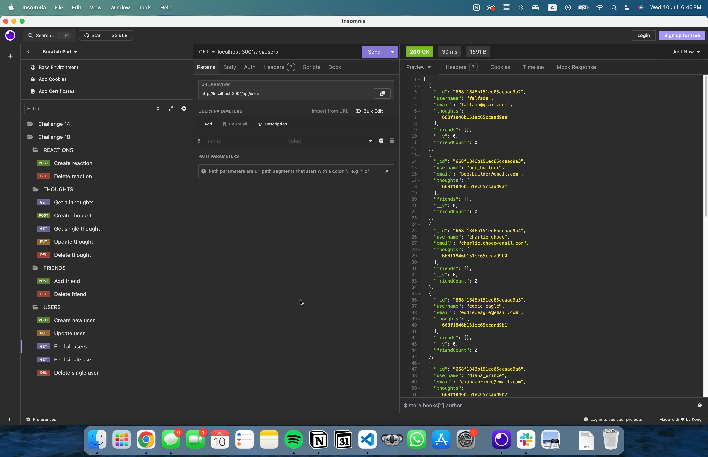

# Social Network API
  

## Description
API for a social network web application using MongoDB and Express.js, facilitated by the Mongoose ODM. This project simulates a social media platform where users can share thoughts, react to friends thoughts, and manage friend lists.

## Table Of Contents
- [Installation](#installation)
- [Usage](#usage)
- [License](#license)
- [Questions](#questions)

## Installation
1. Clone the repository to your local machine using the provided SSH key with the command git clone followed by the link provided by GitHub.
2. Pull the latest changes for the project using the command git pull.
3. Open the folder in your default code editor.
4. Install Node.js on your local machine.
5. Install the dependencies of the project.

## Usage
1. Open the terminal at the project root.
2. Type `npm run seed`.
3. Type `npm run start`.
4. Open Insomnia on the port provided in your terminal.
5. Use GET, POST, DELETE, and PUT requests for `/api/users` to manage information about users.
6. Use GET requests for `/api/users/:id` to get information about a single user.
7. Use GET, POST, DELETE, and PUT requests for `/api/thoughts` to manage information about thoughts.
8. Use GET requests for `/api/thoughts/:id` to get information about a single thought.
9. Use POST and DELETE for `/api/users/:userId/friends/:friendId` to add or delete a friend.
10. Use POST and DELETE for `/api/thoughts/:thoughtId/reactions` to add or delete a reaction.

Alternatively, you can watch the walkthrough [video](https://drive.google.com/file/d/1eowS1QiOpBV1hzh8pAMXxe34c1TAO9EP/view?usp=sharing) demonstrating the app's functionality.

It should resemble the image below

## License
This project is licensed under the terms of the MIT License.
You can find the full text of the license in the LICENSE file or at:
[https://opensource.org/licenses/MIT](https://opensource.org/licenses/MIT)

## Questions
If you have any questions or need further clarification about this project, feel free to reach out to me via email at [falfada@gmail.com](mailto:falfada@gmail.com). I'm always happy to help!

Created by [falfada](https://github.com/falfada)
  